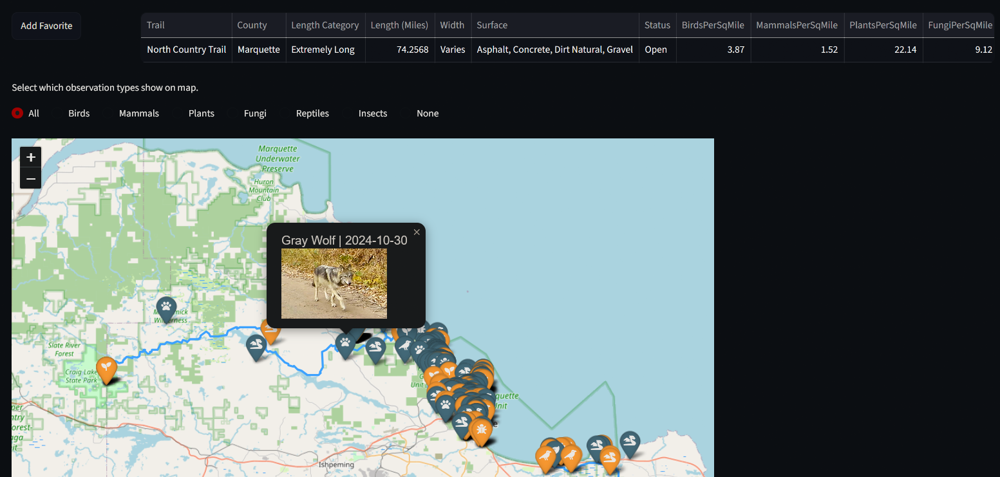
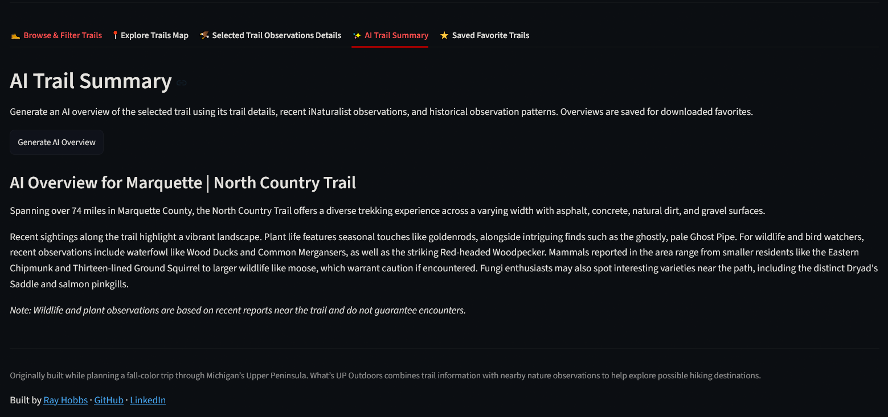
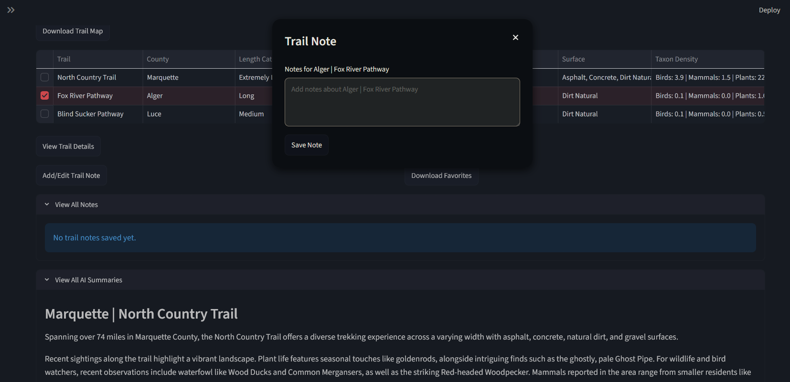

# What’s UP Outdoors

**What’s UP Outdoors** is a Python and Streamlit application for exploring hiking trails and nearby iNaturalist observations across Michigan’s Upper Peninsula.

[Launch the live app](https://whatsupoutdoors-c5jtsxgkfmw9qkuhrnerhq.streamlit.app/) | [Project specification](SPEC.md) | [AI use disclosure](AI_USE_DISCLOSURE.md)

## Overview

The app combines Michigan DNR trail data with recent and historical iNaturalist observations to help users discover trails, compare trail characteristics, and explore reported plants and wildlife nearby.

I started the project while planning a fall-color trip through Michigan’s Upper Peninsula and wanted a practical way to compare hiking options and nearby nature observations.

Users can search by ZIP code, filter trails, explore interactive maps, inspect trail details and observations, generate AI trail summaries, and save favorite trails with notes during the current Streamlit session.

The project also demonstrates geospatial analysis, API integration, reproducible data preparation, Streamlit development, and automated testing.

## Using the App

The application has five main tabs.

### Browse & Filter Trails

Search from a U.S. ZIP code or filter by trail length, surface, and name. ZIP searches return up to 20 nearby trails ordered from nearest to farthest.

<p align="center">
  
</p>

### Explore Trails on Map

View the current trail results on an interactive Folium map and inspect trail information directly from the map.

<p align="center">
  
</p>

### Selected Trail Details

Select a trail to view its characteristics, full geometry, recent iNaturalist observations from the last 21 days, historical September–October observations from 2015–2025, species summaries, and favorite controls.

Observations are filtered to those reported within two miles of the selected trail.

<p align="center">
  
</p>

### AI Trail Summary

Generate an on-demand Google Gemini overview using selected trail details, recent nearby observations, and historical observation-density data.

<p align="center">
  
</p>

### Saved Favorite Trails

Compare saved trails in a table and map, reopen trail details, add notes, remove favorites, and download saved trail data. Notes and generated AI summaries are stored for the current Streamlit session.

<!-- Screenshot:  -->
<p align="center">
  
</p>

## Launch the App

[Open What’s UP Outdoors](https://whatsupoutdoors-c5jtsxgkfmw9qkuhrnerhq.streamlit.app/)

Local development, testing, and ETL reproduction instructions are documented in [`SPEC.md`](SPEC.md).

## Limitations

- ZIP-to-trail distance is straight-line spatial distance, not driving distance.
- Trail status reflects the Michigan DNR source and may not represent current on-site conditions.
- Historical iNaturalist data is limited to September–October 2015–2025, and recent observation availability depends on the iNaturalist API.
- iNaturalist observations are reported sightings and do not guarantee species presence.
- AI summaries use supplied project data and do not retrieve current trail news, conditions, or parking information. Adding live web search for those features would require an external or paid web-search-capable API.
- The app is intended for exploration and trip planning, not navigation or safety guidance.

## Future Enhancements

- **Short-term weather forecasts:** Add forecast data for the selected trail area to the AI overview to support trip planning.
- **AI-assisted parking and current trail information:** Retrieve nearby parking and recent trail news or conditions using web search or another external data source.
- **Automated data refresh pipeline:** Periodically refresh and validate source datasets through an automated ETL workflow.

## Project Structure

```text
Whats_UP_Outdoors/
├── app.py                                  # Streamlit application entry point
├── README.md                               # Project overview and usage
├── SPEC.md                                 # Technical MVP specification
├── requirements.txt                        # Python dependencies
├── AI_USE_DISCLOSURE.md                    # AI-assisted work disclosure
├── static/                                 # App images
├── util/                                   # Offline ETL workflows
│   ├── etl_dnr_trails.py                   # Michigan DNR trail ETL
│   └── etl_inaturalist_history.py          # Historical iNaturalist ETL
├── notebooks/                              # Exploratory analysis
├── reports/                                # Generated profiling output
├── data/
│   ├── raw/                                # Local ETL source data
│   └── processed/                          # App-ready Parquet datasets
├── src/                                    # Reusable application logic
│   ├── apis/                               # External API helpers
│   │   ├── dnr_api.py
│   │   ├── genai_api.py
│   │   └── inaturalist_api.py
│   ├── ai.py                               # AI summary preparation/generation
│   ├── trails.py                           # Trail processing and filtering
│   ├── locations.py                        # ZIP validation and geocoding
│   ├── spatial.py                          # Spatial calculations and filtering
│   ├── inaturalist.py                      # Observation processing/summaries
│   ├── streamlit_ui.py                     # Streamlit UI helpers and favorites
│   └── maps.py                             # Folium maps
└── tests/                                  # Pytest suite
```
